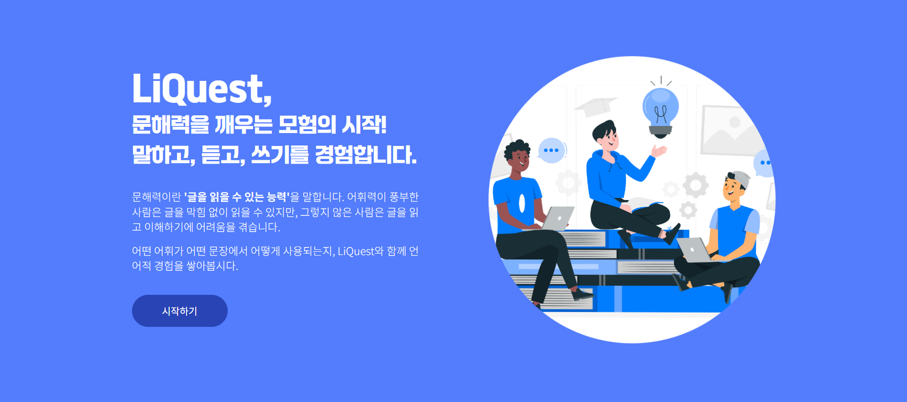

#  LiQuest

KT 에이블스쿨 4기, 7반 19조 빅프로젝트 산출물 'LiQuest' 입니다.

웹 서비스 `LiQuest`는 생성형 AI를 활용한 교육 플랫폼으로, 아이들의 문해력 향상을 돕기 위해 다음과 같은 서비스를 제공합니다.

- 단어 퀴즈
    - 잘 알고 있나요? 익숙지 않은 어휘는 없는지 확인해 봅시다!
- 단어 연습장
    - 문해력 차이는 곧 언어적 경험의 차이! 단계 별 학습 사이클을 따라 경험을 쌓아보세요.
- 작문해보기
    - 학습한 단어를 조합해 작문해 봅시다! ChatGPT가 확인하고 피드백을 제공합니다.

## ✨ *LiQuest* 서비스 바로가기
[ LiQuest - 문해력을 깨우는 모험의 시작 :: github.io](https://yewon-saurus.github.io/Aivle_BigProjectFE_19/)

[ 프론트엔드 저장소 :: GitHub :: yewon-saurus/Aivle_BigProjectFE_19](https://github.com/yewon-saurus/Aivle_BigProjectFE_19) <br>
[ 백엔드 저장소 :: GitHub :: 6eom9eun/Aivle_BigProjectBE_19](https://github.com/6eom9eun/Aivle_BigProjectBE_19)

---
# Getting Started

## Prerequisites
- `nodejs >= 14.x`
- `npm >= 6.x`
- `Python >= 3.10.x`

## Installation
1. 소스코드 다운로드
    ```bash
    $ git clone https://github.com/yewon-saurus/Aivle_4th_BigProject_team19_LiQuest.git
    ```
2. 서브 모듈 초기화 및 업데이트
    ```bash
    $ cd Aivle_4th_BigProject_team19_LiQuest
    Aivle_4th_BigProject_team19_LiQuest $ git submodule init
    Aivle_4th_BigProject_team19_LiQuest $ git submodule update
    ```

    ```bash
    Aivle_4th_BigProject_team19_LiQuest $ git submodule update --remote
    ```
3. React npm 패키지 설치
    ```bash
    $ cd LiQuest_client
    LiQuest_client $ npm install
    ```
3. Django pip 패키지 설치
    ```bash
    $ cd LiQuest_server
    LiQuest_server $ pip install -r requirements.txt
    ```

    - 이중에서도 특히, 아래 패키지는 버전을 맞춰주어야 합니다.
        - `paddleocr==2.6.0.1`
        - `django-allauth==0.58`
        - `numpy==1.23.5`
